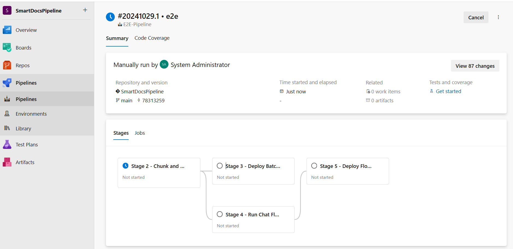
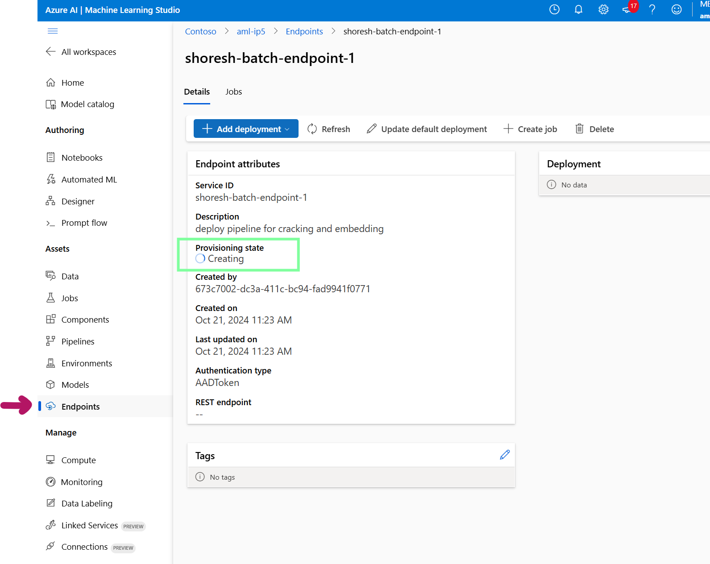
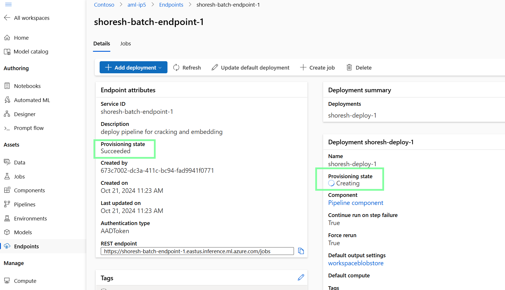
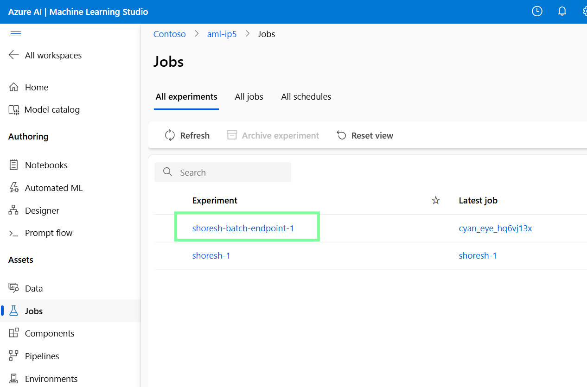

# Prerequisites

- An **Azure subscription** is required to create services such as **Azure Machine Learning**, **Azure OpenAI**, **Azure AI Search**, and **Azure AI Document Intelligence**. Ensure that your account has the necessary permissions to create **App Registrations**.
- In this repo we use Azure Open AI ,make sure you have avaialble capacity for the following models


- we use Eastus reagion to ensure we get feature of Semantic ranker for AI search , if you need other reagion make sure the availability of semantic ranking feature for Azure AI Search


- You will need **Azure DevOps** access to create Projects and Repos within your organization.

- In the config.json we used Standard_D4a_v4 so make sure in reagion you have enough qouta for this compute 


# Setup

## Step 1: Create a Project and Repo in Azure DevOps

1. Log into your Azure DevOps account and create a new Project in your organization. For example, name it `SmartDocsPipeline` (If you use this name, you won't need to update the `pipeline.yml` files later).
   
   

2. Inside the project, create a new Repository by importing from: `https://github.com/shoresh57/SmartDocsPipeline.git`.

   

## Step 2: Set Up the Azure DevOps Project

### 1. Create a Service Principal

1. In the Azure Portal (https://ms.portal.azure.com/), open **Cloud Shell** and paste the following script. Replace `<YOUR-SUBSCRIPTION-ID>` and `GIVE A NAME` with your actual Azure Subscription ID and the desired Service Principal name.

   ```bash
   az account set --subscription <YOUR-SUBSCRIPTION-ID>

   roleName="Owner"
   subscriptionId="<YOUR-SUBSCRIPTION-ID>"
   servicePrincipalName="GIVE A NAME"

   az ad sp create-for-rbac --name $servicePrincipalName --role $roleName --scopes /subscriptions/$subscriptionId 
   ```

2. Save the output in a secure location for future steps.


### 2. Create a Service Connection

1. In **Azure DevOps**, navigate to **Project Settings** > **Service Connections** > **Create Service Connection** > **Azure Classic**.
2. Select **Identity Type** as **App Registration** or **Managed Identity (Manual)**.
3. Provide the credentials (e.g., secret) from the previous step and verify the connection.


### 3. Create a Variable Group

1. In Azure DevOps, navigate to **Project** > **Pipelines** > **Library** > **Create Variable Group**. Name the group `vg1` (If you use this name, you won't need to update the `pipeline.yml` files later).
2. Use the following variables:
   - `LOCATION` (e.g., `eastus` for Azure AI Search with semantic ranking)
   - `PROVISION_RESOURCE`
   - `RESOURCE_GROUP`
   - `SERVICE_CONNECTION` (Name of the service connection created earlier)
   - `SERVICE_PRINCIPAL_ID`
   - `SUBSCRIPTION_ID`


### 4. Run Provission Pipeline

1. In Azure DevOps, navigate to **Pipelines** > **Create Pipeline** > **Azure Repos Git** > **SmartDocsPipeline** > **Existing Azure Pipelines YAML file**.
2. Select `/Pipeline/6-E2E-Provission.yml`, but do **NOT** run it yet—just save it.
3. Rename the pipeline to **"E2E-Provission"** and then save and Run it


save **definitionId** which we need to use it later . it is part of url in above picture 

4. Run pipeline and give neccessary permission 


Make sure  Azure Devops variable Group Vg1 the Value of PROVISION_RESOURCE = "true" so first you need give permission for stage 1 to create Azure resorces .


5. When the run finished This pipeline create  required Azure resources in Stage 1 

### 5. Outcome

### Stage 1: 

#### Infra/config.json

This file centralizes the configuration for provisioning and interacting with services like OpenAI models, Azure Cognitive Search, and Azure Machine Learning. It helps ensure consistency and ease of modification across deployments.

#### Infra/provision_resources.py

This script automates the provisioning of resources, such as Azure Machine Learning workspaces and AI services. Here's an overview of its key functionalities:

1. **Environment Setup**: Loads essential variables like `SERVICE_CONNECTION`, `SUBSCRIPTION_ID`, and `RESOURCE_GROUP`.
2. **Configuration Parsing**: Reads the `Infra/config.json` file for service details and names.
3. **Resource Group Management**: Recreates resource groups to ensure a clean start.
4. **AI Service Creation**: Provisions Azure AI services (Cognitive Search, Form Recognizer, OpenAI) using Azure CLI.
5. **Azure ML Setup**: Sets up the workspace and compute resources for Azure Machine Learning.
6. **Model Deployment**: Deploys specified models (e.g., GPT-4o) to the OpenAI service.
7. **Resource Connections**: Generates YAML files and creates service connections for use in AI workflows.
8. **Storage Management**: Uploads environment files and sample data to Azure Blob Storage.
9. **Main Orchestration**: Ensures all steps run smoothly, creating a seamless machine learning workflow.


The sample.pdf loaded to Azure storage account and we use that for rest of pipeline 


### 6. Run 6-E2E-Pipeline.yml 

1. In Azure DevOps, navigate to **Pipelines** > **Create Pipeline** > **Azure Repos Git** > **SmartDocsPipeline** > **Existing Azure Pipelines YAML file**.
2. Select `/Pipeline/6-E2E-Pipeline.yml`, but do **NOT** run it yet—just save it.
3. Rename the pipeline to **"E2E-Pipeline"** and then save and edit it

change definition number with the number you got in previous step (4.3 ) then save 


4. Run pipeline and give neccessary permission , keep in mind stage 3 and 5 need manual approval 



### 7. Outcome

### Stage 2: 

Now, go to the Azure Portal, access the created resource group, and launch Azure Machine Learning Studio. Inside Azure ML Studio, you should see the running job.


---

**Click** on the job to view the entire pipeline.


---

**Double-click** on each box to get detailed information about execution code, environment, logs, parameters, etc.


- In previous step 6-E2E-Provission.yml , the `Data/Sample.pdf` was uploaded as part of the script into the Azure Storage account. The stage 2 of 6-E2E-Pipeline.yml performs chunking, embedding, and registers the index for this sample PDF file.
- Open the Azure Portal, navigate to the Storage account, and click on **Containers**, then select **azureml-blobstore**. You will see several folders, including `Data`, `embeddings`, and `Environment`. These folders represent the input and output of our pipeline tasks.


---

Here are the folders:


---

- In the Azure Portal, within the created resource group, open the AI Search service and click on **Indexes**. You will see the sample.pdf file chunked into 37 files, all registered inside Azure AI Search.


---

- The created pipeline can be scheduled, modified (you need to clone it first and then modify it inside Designer), or deployed to trigger based on events.


#### Deep Dive into Chunk-Embed-Index/chunk_embed_index.py

#### Overview

This script automates the deployment and execution of an Azure Machine Learning pipeline, integrating with Azure services like Azure OpenAI and Azure Cognitive Search (ACS). It processes, chunks, embeds data, and registers the results as ML assets.

#### Key Components

#### 1. Imports and Setup

The script imports essential libraries for:
- Interacting with Azure services.
- Managing pipelines.
- Handling environment variables and configuration files.

#### 2. Configuration Parsing

The `parse_config_file()` function reads a JSON configuration file to extract key parameters, including:
- **Chunk Size**
- **Overlap**
- **Azure ML settings** (e.g., compute size)

#### 3. Loading Environment Variables

The `load_env_vars()` function loads Azure-related environment variables from a `.env` file, including:
- **Subscription ID**
- **Resource Group**
- **Workspace Names**

#### 4. Pipeline Definition and Execution

- **Authentication**: Uses `DefaultAzureCredential` to authenticate with Azure.
- **MLClient Setup**: Initializes `MLClient` to interact with the Azure Machine Learning workspace and registry.
- **Pipeline Components**: Retrieves and configures components from Azure ML (e.g., chunk and embed, update ACS index, and register ML index). If a connection ID for the Document Intelligence service is provided, it extracts content from the PDF document.


- **Pipeline Structure**: The `uri_to_acs()` pipeline processes input data, chunks it, embeds it using a model, updates an ACS index, and registers the resulting ML index as an asset.

### Stage 3: 

The goal of this stage is to deploy and test the Azure Machine Learning (Azure ML) pipeline, which performs chunking, embedding, and saves the index in **Azure AI Search**

In **Azure ML Studio**, navigate to **Endpoints** and **Batch Endpoints**. You will observe the creation of the endpoint and the subsequent deployment of the pipeline.




The next step is to test the deployed pipeline. Head to **Azure ML Studio** and inspect the jobs created during this process.




The entire deployment and testing process may take several minutes.

We have successfully deployed and tested our pipeline. This pipeline can now be used in a trigger-based scenario, such as when new data is added or deleted, to automatically update the index. There are several ways to implement a trigger-based setup, including combining **Azure Event Grid** with **Azure Logic Apps** or **Azure Functions**.

For more information on Azure Functions and Event Grid, refer to [Azure Functions with Event Grid Blob Trigger](https://learn.microsoft.com/en-us/azure/azure-functions/functions-event-grid-blob-trigger?pivots=programming-language-python).

### Key Stages:

1. **DeployBatchPipeline**:
   - **ApproveDeployment job**: A manual approval step requiring user intervention via email notification. Deployment proceeds after approval.
   - **DeployBatchPipeline job**: Once approved, the job installs Python dependencies, downloads artifacts, and runs the deployment script (`deploy_and_test_pipeline.py`). It uses the Azure CLI for authentication and ensures all necessary dependencies are in place.

## Deep Dive into `Chunk-Embedd-Index/deploy_and_test_pipeline.py`

The `deploy_and_test_pipeline.py` script automates the process of deploying and testing an Azure ML batch pipeline. Below is a breakdown of its primary functions:

### 1. Load and Parse Configuration:
- Parses a JSON file (`config.json`) containing batch deployment details such as the endpoint, deployment, asset name, and data source.
- Loads environment variables from a `.env` file, including Azure credentials (subscription ID, resource group, and workspace).

### 2. Authentication:
- Authenticates using `DefaultAzureCredential` for seamless access to Azure resources without passing credentials explicitly.
- Creates an `MLClient` instance for interacting with Azure ML services.

### 3. Batch Endpoint Creation:
- Creates or updates the batch endpoint, which will be the target for running the batch inference jobs.

### 4. Pipeline Deployment:
- Deploys the pipeline to the batch endpoint, ensuring the latest changes are used by forcing a rerun.
- Retrieves the `pipeline_job_id` from `pipeline_job_id.txt` for deployment.

### 5. Monitor Deployment Status:
- Continuously monitors the provisioning state of the deployment, handling any errors or retries as necessary.

### 6. Test the Endpoint:
- Invokes a test job after deployment, sending input data to the endpoint and specifying where to store the output.
- Streams logs to the console to track job progress.

### 7. Automation and Execution:
- The `main()` function ties all these processes together, ensuring the smooth automation of the deployment and testing of the batch pipeline.

### Stage 4: 

The goal of this stage is to create a chat flow with Promptflow and evaluate the flow pipeline.

Navigate to **Azure ML Studio** and verify the following:


Once the process is completed, you will see the following outputs:


The evaluation runs can be viewed as follows:


If necessary, you can modify the main chat flow by cloning the flow:


In this stage, we created chat flow and evaluation pipelines to evaluate the performance of the chat flow based on `Data/data.jsonl`. For evaluation, we used two metrics: **Similarity** and **Groundedness**.

---

## Deep Dive into `Flow/generateyml.py`

### YAML File Generation Script for Azure Machine Learning Workflow

#### Goal

The script automates the generation and configuration of multiple YAML files used in a machine learning workflow that integrates with Azure Machine Learning services, Azure OpenAI models, and a search index.

### Primary Functions

#### 1. Loading Environment Variables and Configuration

- Loads critical environment variables from a `.env` file and configuration data from `config.json`, which includes:
  - Subscription IDs
  - Resource group names
  - API keys
  - OpenAI deployment names

#### 2. Templating and Value Replacement

- Constructs YAML templates for different components of the machine learning workflow, such as:
  - Chat flow
  - Similarity evaluation
  - Groundedness evaluation
- Dynamically replaces placeholders (e.g., `{{deployment_name}}` and `{{SUBSCRIPTION_ID}}`) with actual values from environment variables and configuration.

#### 3. Creating YAML Workflow Files

- Writes the formatted YAML files into locations such as:
  - `Flow/ChatFlow/flow.dag.yaml`
  - `Flow/Evaluation/Groundedness/flow.dag.yaml`
  - `Flow/Evaluation/Similarity/flow.dag.yaml`

  These files define workflows for tasks including:
  - **Chat flow**: Processes queries, rewrites intents, runs searches, chunks documents, and generates responses.
  - **Similarity and Groundedness evaluation**: Evaluates the similarity between a question and an answer and checks whether the generated responses are grounded in the provided context.

#### 4. Error Handling

- Validates that all required environment variables and configuration values are present, raising an error if any are missing.


The script automates the process of configuring and deploying machine learning workflows by generating YAML files with the necessary API connections, models, and search components for evaluating responses in an Azure-based environment.

---

## Deep Dive into `Flow/chat_flow_and_eval.py`

### Script Goal

The script sets up and evaluates a chat flow using Azure Machine Learning and Azure OpenAI services.

### Key Objectives

#### Environment Setup
- Loads the necessary environment variables and configuration settings to connect to Azure services.

#### Authentication
- Authenticates to Azure securely, retrieving the necessary credentials.

#### Data Path Verification
- Verifies that the specified data file path exists, ensuring input data is available for evaluation.

#### Azure OpenAI Connection
- Establishes or updates a connection to Azure OpenAI to interact with models.

#### Data Asset Creation
- Registers a data asset with Azure Machine Learning containing the input data for evaluation.

#### Flow Execution
- Creates and runs a chat flow using the registered data asset to handle input queries and generate responses.

#### Flow Evaluation
- Evaluates the generated responses using similarity and groundedness metrics, comparing them with the ground truth.

#### Decision Making
- Computes a score based on the evaluation metrics and decides whether to proceed with deployment. The results are written to a JSON file.

#### Output Reporting
- Prints the combined metrics and deployment decision to the console.

### Stage 5: 

In this stage, we deployed chat flow as managed online endpoint and now we can use it in our application.

 In **Azure ML Studio**, navigate to **Endpoints** and **Real-time Endpoints**. You will observe the creation of the endpoint and the subsequent deployment of the pipeline.


The Pipeline deploy flow as managed online endpoint an test enpoint BUT you can test it manaualy too 


## Deep Dive into `Flow/deploy_test_flow.py`

## Azure ML Deployment Script - Key Points

This Python script automates the deployment of a machine learning model to Azure, setting up an endpoint and deploying a model in a managed online environment. Key functionalities include loading configurations, authenticating, creating role assignments, deploying the model, and testing the endpoint.

### Overview
The script performs the following main tasks:
1. **Configuration Loading** - Reads configuration from a JSON file and environment variables.
2. **ML Client Authentication** - Authenticates using Azure's `DefaultAzureCredential`.
3. **Role Assignment** - Sets role-based access to Azure resources.
4. **Endpoint Creation** - Creates or updates an online endpoint for model deployment.
5. **Model Deployment** - Deploys a machine learning model and an environment for inference.
6. **Deployment Status Check** - Monitors deployment progress until successful.
7. **Endpoint Testing** - Tests the deployed model endpoint with sample data.

### Functions

#### 1. `load_config()`
- Loads settings from `config.json` and environment variables (`.env`).
- Returns essential deployment parameters (e.g., subscription ID, resource group, compute size).

#### 2. `get_ml_client(config)`
- Authenticates and returns an MLClient using `DefaultAzureCredential`.

#### 3. `create_role_assignment(scope, role_name, principal_id)`
- Assigns specific roles (e.g., `Cognitive Services OpenAI User`, `Search Index Data Contributor`) to the model endpoint.
- Enables secure access to required Azure resources.

#### 4. `create_endpoint(config)`
- Sets up an online endpoint to handle requests for the deployed model.
- Uses Azure CLI to create role assignments for identity-based access control.

#### 5. `deploy_managed_online(config)`
- Deploys the model and environment on Azure ML.
- Defines health check routes and sets environment variables for deployment.
- Sets traffic routing to the deployed endpoint (100% traffic to the current deployment).

#### 6. `wait_for_deployment(config)`
- Checks deployment status periodically until completion.
- Logs deployment status and retries on errors.

#### 7. `test_endpoint(config)`
- Validates the endpoint with a sample JSON request.
- Uses primary key for authentication and handles HTTPS self-signed certificates if necessary.
- Attempts multiple retries on failure.

#### 8. `get_decision_from_json(path_file)`
- Reads the `deploy.json` file for a "decision" key to control script execution.
- If the decision is "yes," the main deployment process starts.

### Execution Flow (`main()`)
1. Loads configurations and environment variables.
2. Creates and configures the endpoint.
3. Deploys the model and waits for successful deployment.
4. Tests the endpoint and validates model predictions.


## Tested Environment

This code has been tested and verified using the following versions:

- **Azure CLI**: 2.65.0
  - **Core**: 2.65.0
  - **Telemetry**: 1.1.0

### Extensions
- **azure-devops**: 1.0.1
- **ml**: 2.31.1

### Dependencies
- **msal**: 1.31.0
- **azure-mgmt-resource**: 23.1.1

### System Information
- **Python Version**: 3.11.8 (Linux)
- **Python Location**: /opt/az/bin/python3
- **Extensions Directory**: /opt/az/azcliextensions
- **Secondary Python Version**: 3.10.15
- **pip Version**: 24.2
- **Bash Version**: 5.1.16 (x86_64-pc-linux-gnu)


