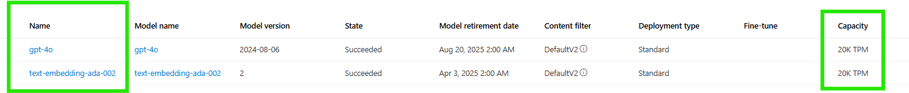
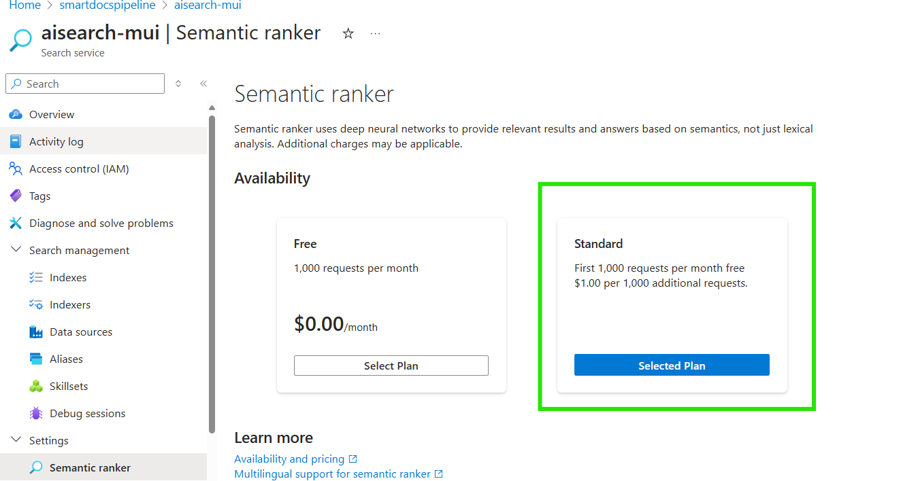
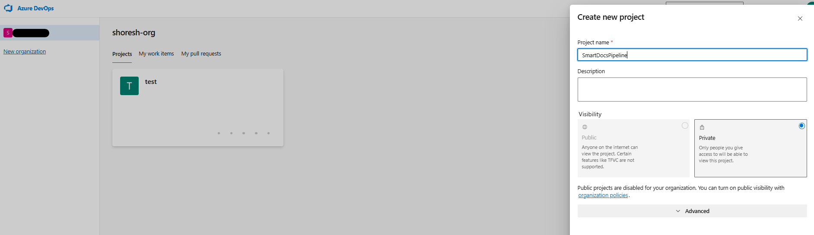
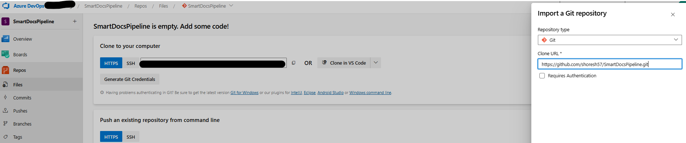
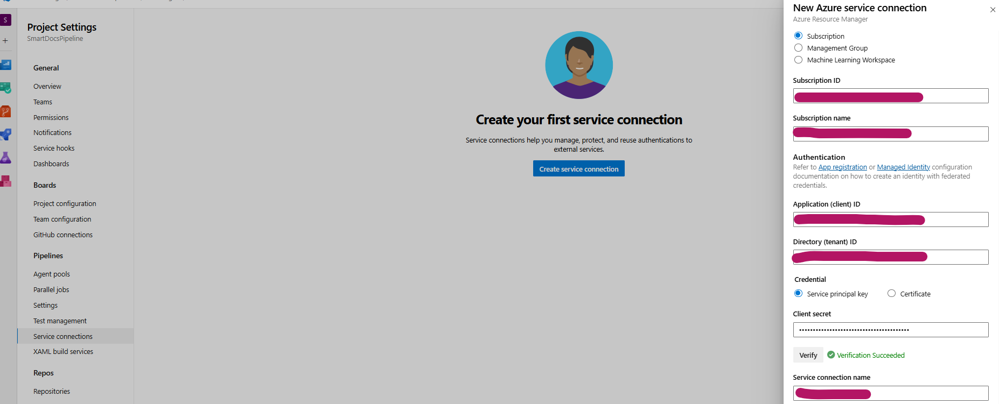
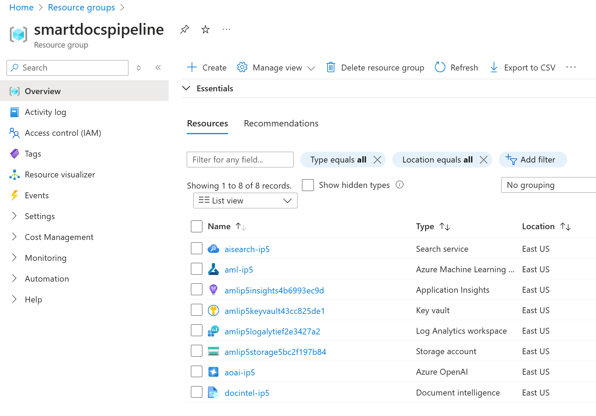

# Lab 01: Provision Azure Resources

## Prerequisites

- An **Azure subscription** is required to create services such as **Azure Machine Learning**, **Azure OpenAI**, **Azure AI Search**, and **Azure AI Document Intelligence**. Ensure that your account has the necessary permissions to create **App Registrations**.
- In this repo we use Azure Open AI ,make sure you have avaialble capacity for the following models
     

- we use Eastus reagion to ensure we get feature of Semantic ranker for AI search , if you need other reagion make sure the availability of semantic ranking feature for Azure AI Search

     

- You will need **Azure DevOps** access to create Projects and Repos within your organization.

## Setup

### Step 1: Create a Project and Repo in Azure DevOps

1. Log into your Azure DevOps account and create a new Project in your organization. For example, name it `SmartDocsPipeline` (If you use this name, you won't need to update the `pipeline.yml` files later).
   
   

2. Inside the project, create a new Repository by importing from: `https://github.com/shoresh57/SmartDocsPipeline.git`.

   

### Step 2: Set Up the Azure DevOps Project

#### 1. Create a Service Principal

1. In the Azure Portal (https://ms.portal.azure.com/), open **Cloud Shell** and paste the following script. Replace `<YOUR-SUBSCRIPTION-ID>` and `GIVE A NAME` with your actual Azure Subscription ID and the desired Service Principal name.

   ```bash
   az account set --subscription <YOUR-SUBSCRIPTION-ID>

   roleName="Owner"
   subscriptionId="<YOUR-SUBSCRIPTION-ID>"
   servicePrincipalName="GIVE A NAME"

   az ad sp create-for-rbac --name $servicePrincipalName --role $roleName --scopes /subscriptions/$subscriptionId 
   ```

2. Save the output in a secure location for future steps.

   

#### 2. Create a Service Connection

1. In **Azure DevOps**, navigate to **Project Settings** > **Service Connections** > **Create Service Connection** > **Azure Classic**.
2. Select **Identity Type** as **App Registration** or **Managed Identity (Manual)**.
3. Provide the credentials (e.g., secret) from the previous step and verify the connection.

   

#### 3. Create a Variable Group

1. In Azure DevOps, navigate to **Project** > **Pipelines** > **Library** > **Create Variable Group**. Name the group `vg1` (If you use this name, you won't need to update the `pipeline.yml` files later).
2. Use the following variables:
   - `LOCATION` (e.g., `eastus` for Azure AI Search with semantic ranking)
   - `PROVISION_RESOURCE`
   - `RESOURCE_GROUP`
   - `SERVICE_CONNECTION` (Name of the service connection created earlier)
   - `SERVICE_PRINCIPAL_ID`
   - `SUBSCRIPTION_ID`

   

#### 4. Provision Azure Resources

1. In Azure DevOps, navigate to **Pipelines** > **Create Pipeline** > **Azure Repos Git** > **SmartDocsPipeline** > **Existing Azure Pipelines YAML file**.
2. Select `/Pipeline/1-Provision-Resources.yml`, but do **not** run it yet—just save it.
3. Rename the pipeline to **"1-Provision Resource"** and then run it.
4. You might get a warning about permissions; approve the permissions to proceed.

   

   

## Deep Dive into Key Files

### Pipeline/1-Provision-Resources.yml

The goal of this YAML file is to automate the provisioning of Azure resources using a multi-stage Azure DevOps pipeline. This pipeline handles:

- Environment setup
- Installing dependencies
- Authenticating with Azure
- Running the provisioning script
- Capturing environment details for future use

The **provision_resources.py** script manages the cloud infrastructure creation for your project.

### Infra/config.json

This file centralizes the configuration for provisioning and interacting with services like OpenAI models, Azure Cognitive Search, and Azure Machine Learning. It helps ensure consistency and ease of modification across deployments.

### Infra/provision_resources.py

This script automates the provisioning of resources, such as Azure Machine Learning workspaces and AI services. Here's an overview of its key functionalities:

1. **Environment Setup**: Loads essential variables like `SERVICE_CONNECTION`, `SUBSCRIPTION_ID`, and `RESOURCE_GROUP`.
2. **Configuration Parsing**: Reads the `Infra/config.json` file for service details and names.
3. **Resource Group Management**: Recreates resource groups to ensure a clean start.
4. **AI Service Creation**: Provisions Azure AI services (Cognitive Search, Form Recognizer, OpenAI) using Azure CLI.
5. **Azure ML Setup**: Sets up the workspace and compute resources for Azure Machine Learning.
6. **Model Deployment**: Deploys specified models (e.g., GPT-4o) to the OpenAI service.
7. **Resource Connections**: Generates YAML files and creates service connections for use in AI workflows.
8. **Storage Management**: Uploads environment files and sample data to Azure Blob Storage.
9. **Main Orchestration**: Ensures all steps run smoothly, creating a seamless machine learning workflow.

## Outcome of Lab 01

By the end of this lab, you'll have successfully provisioned the necessary Azure resources.




For the next lab, you will need the **definitionId** from the published artifact.

1. Navigate to **Pipelines** > **1-Provision Resource**.
2. Note down the URL for use in the upcoming labs.


