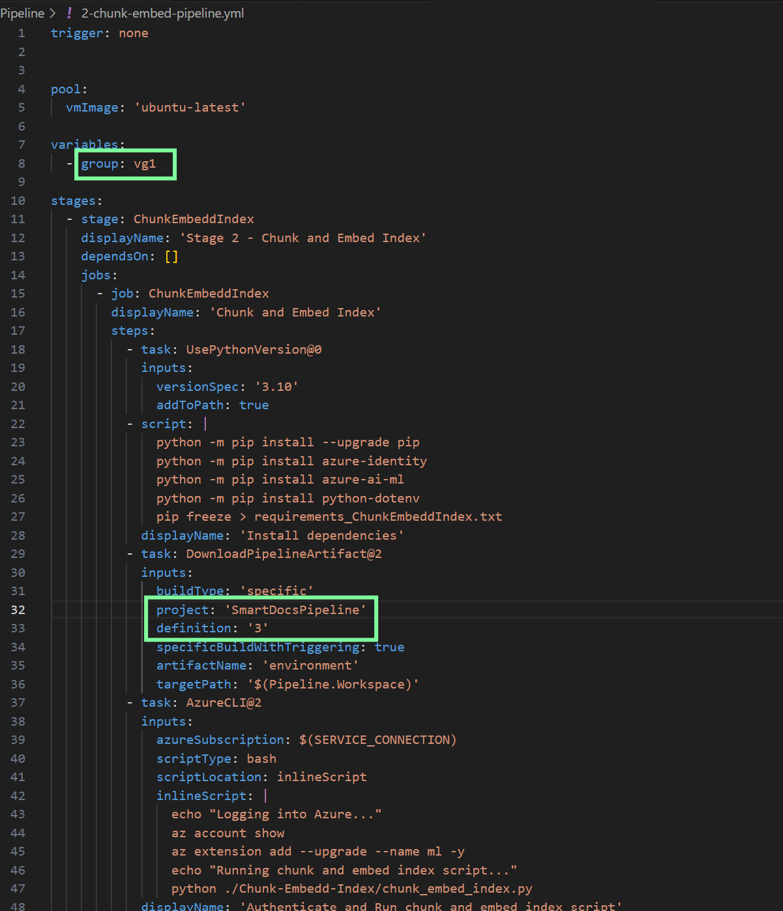
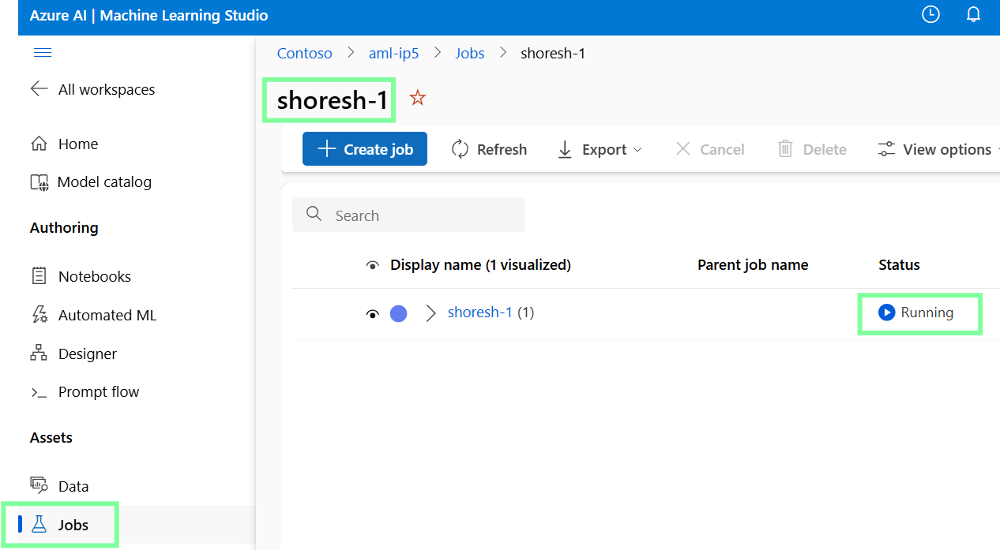
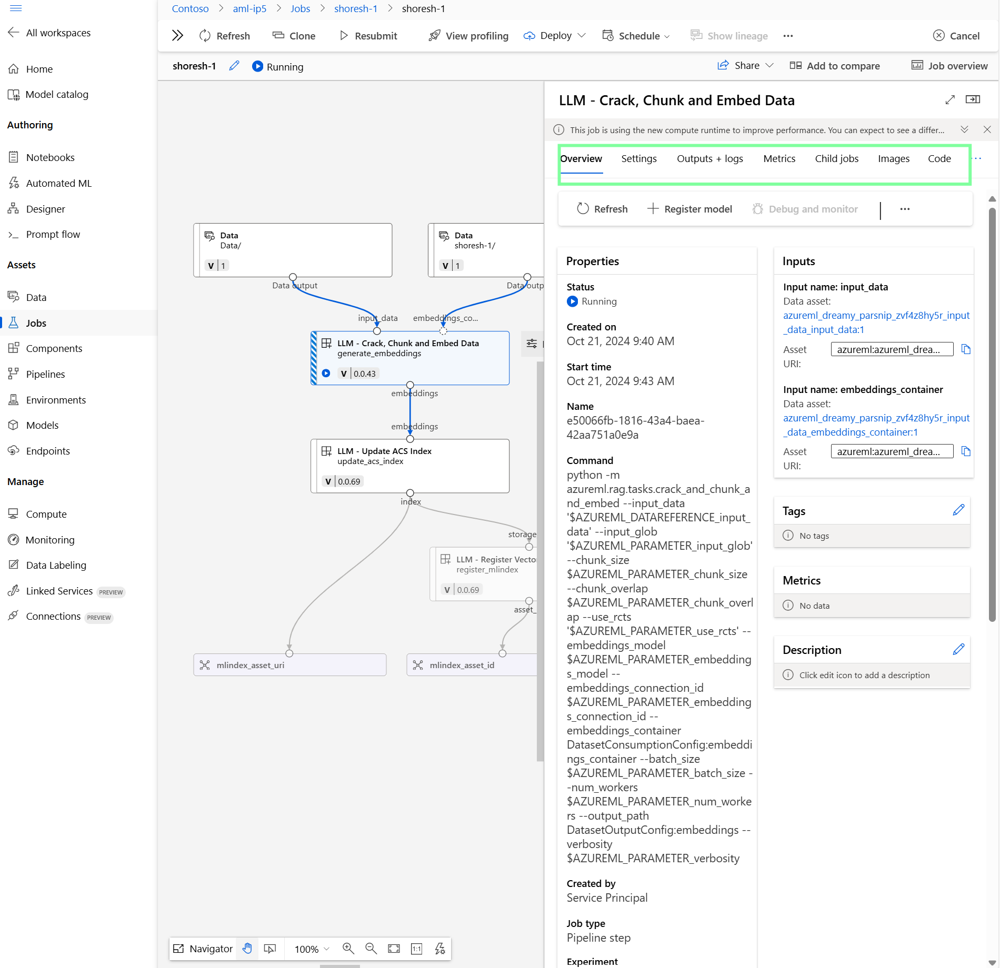
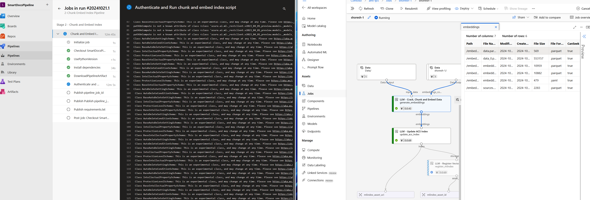
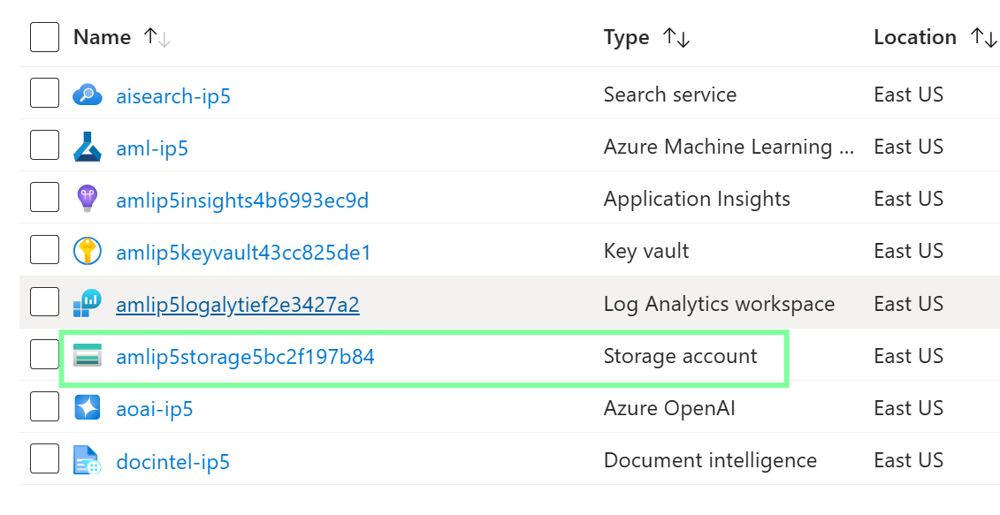
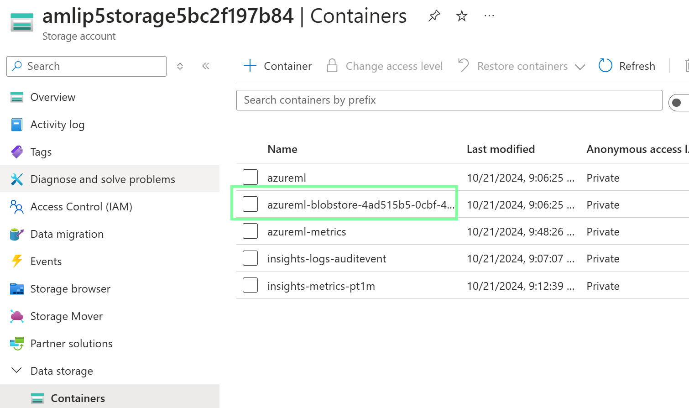
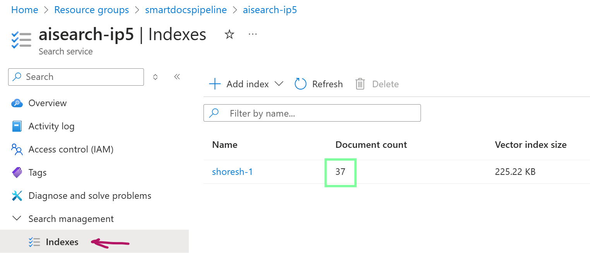
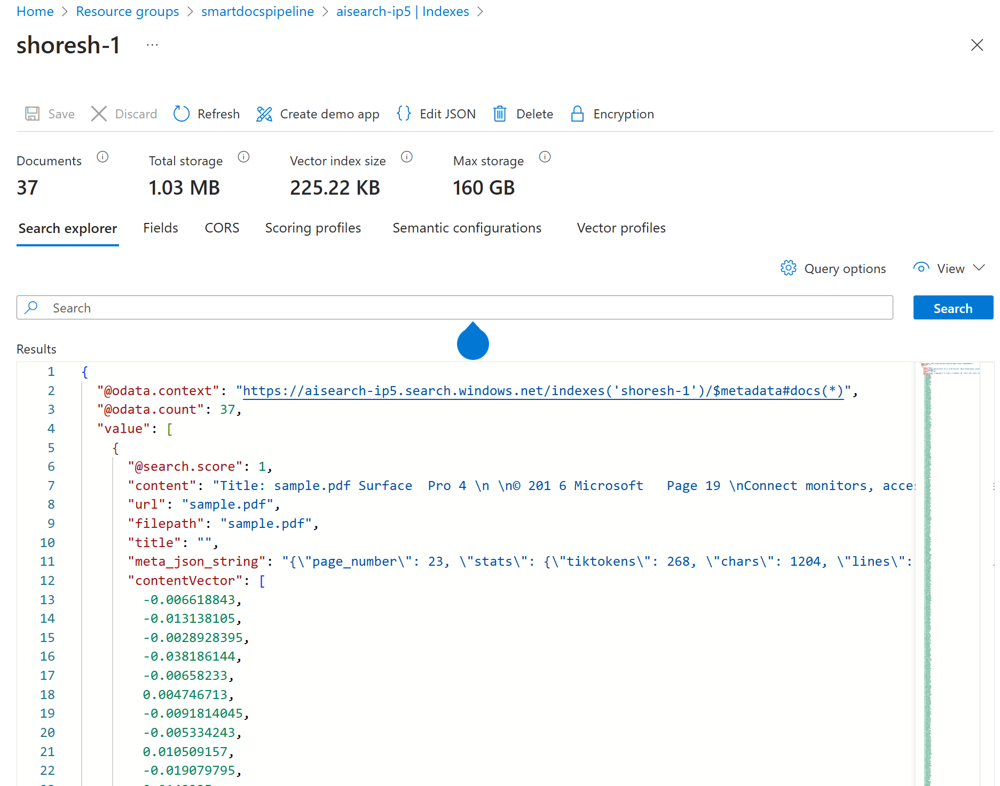

# Lab 02: Chunking, Embedding, and Indexing

## Prerequisites

Ensure you have completed **Lab 01** before proceeding with this lab.

## Setup

### Configure the Pipeline

#### 2-chunk-embed-pipeline.yml in the Pipeline Folder

If your variable group name is `vg1` and your Azure DevOps project name is `SmartDocsPipeline`, you do not need to change anything except for the `definitionId`, which you obtained from Lab 01.

## Running the Pipeline

In this stage, the goal is to create an Azure ML Pipeline that performs chunking, embedding, and saves the index in Azure AI Search.

1. Navigate to **Azure DevOps > SmartDocsPipeline > Pipelines**.
2. Select **Create Pipeline**.
3. Choose **Azure Repos Git** and select `SmartDocsPipeline`.
4. Select the existing Azure Pipelines YAML file located at `/Pipeline/2-chunk-embed-pipeline.yml`. Do not run it yet; just save it.
5. Go back to the **Pipelines** section and rename the pipeline to **"2-Chunk Embed Index Pipeline"**.
6. Click **Run**. You will receive a warning about permissions; grant the necessary permissions.

---

Now, go to the Azure Portal, access the created resource group, and launch Azure Machine Learning Studio. Inside Azure ML Studio, you should see the running job.

---

Click on the job to view the entire pipeline.

---

Double-click on each box to get detailed information about execution code, environment, logs, parameters, etc.

## Outcomes

- In Lab 01, the `Data/Sample.pdf` was uploaded as part of the script into the Azure Storage account. This lab performs chunking, embedding, and registers the index for this sample PDF file.
- Open the Azure Portal, navigate to the Storage account, and click on **Containers**, then select **azureml-blobstore**. You will see several folders, including `Data`, `embeddings`, and `Environment`. These folders represent the input and output of our pipeline tasks.

---

Here are the folders:

---

- In the Azure Portal, within the created resource group, open the AI Search service and click on **Indexes**. You will see the sample.pdf file chunked into 37 files, all registered inside Azure AI Search.

---

- The created pipeline can be scheduled, modified (you need to clone it first and then modify it inside Designer), or deployed to trigger based on events.

---

- We also need the `definitionId` for the next lab.

## Deep Dive into Pipeline/2-chunk-embed-pipeline.yml

The goal of this pipeline is to automate a series of tasks related to chunking and embedding an index within an Azure environment. Here’s a summary of each step:

1. **Python Setup**: Ensures Python 3.10 is installed, upgrades pip, and installs dependencies such as `azure-identity`, `azure-ai-ml`, and `python-dotenv`.
2. **Artifact Download**: Downloads an artifact related to the environment from a specific build of the SmartDocsPipeline.
3. **Azure Authentication**: Authenticates into Azure, installs the necessary Azure Machine Learning CLI extensions, and runs the `chunk_embed_index.py` script.
4. **Artifact Publishing**: Publishes the job ID and requirements as pipeline artifacts for further use.

This pipeline focuses on automating the process of chunking and embedding indexes while managing dependencies and outputs as artifacts.

## Deep Dive into Chunk-Embed-Index/chunk_embed_index.py

### Overview

This script automates the deployment and execution of an Azure Machine Learning pipeline, integrating with Azure services like Azure OpenAI and Azure Cognitive Search (ACS). It processes, chunks, embeds data, and registers the results as ML assets.

### Key Components

#### 1. Imports and Setup

The script imports essential libraries for:
- Interacting with Azure services.
- Managing pipelines.
- Handling environment variables and configuration files.

#### 2. Configuration Parsing

The `parse_config_file()` function reads a JSON configuration file to extract key parameters, including:
- **Chunk Size**
- **Overlap**
- **Azure ML settings** (e.g., compute size)

#### 3. Loading Environment Variables

The `load_env_vars()` function loads Azure-related environment variables from a `.env` file, including:
- **Subscription ID**
- **Resource Group**
- **Workspace Names**

#### 4. Pipeline Definition and Execution

- **Authentication**: Uses `DefaultAzureCredential` to authenticate with Azure.
- **MLClient Setup**: Initializes `MLClient` to interact with the Azure Machine Learning workspace and registry.
- **Pipeline Components**: Retrieves and configures components from Azure ML (e.g., chunk and embed, update ACS index, and register ML index). If a connection ID for the Document Intelligence service is provided, it extracts content from the PDF document.

- **Pipeline Structure**: The `uri_to_acs()` pipeline processes input data, chunks it, embeds it using a model, updates an ACS index, and registers the resulting ML index as an asset.

#### 5. Job Submission and Monitoring

The script submits the pipeline job to Azure and monitors its status in real-time using Azure CLI commands, continuously checking if the job is:
- **Completed**
- **Failed**
- **Still Running**

It logs the status at regular intervals.

### Highlights

- **Modular Design**: Functions are modular and reusable, handling optional inputs and setting automatic compute resources for pipeline components.
- **Environment Management**: Combines configuration files and environment variables for flexibility.
- **Real-time Monitoring**: Includes a job status check and a retry mechanism in case of errors or job delays.

This script provides a robust framework for running machine learning pipelines in Azure, managing configuration, and ensuring real-time feedback on job progress.
