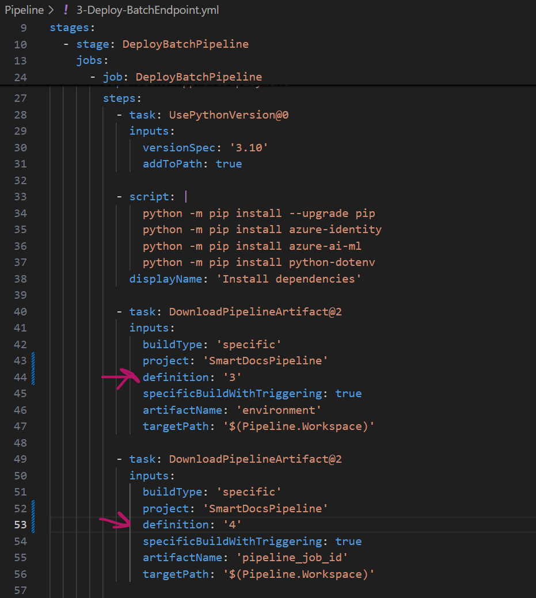
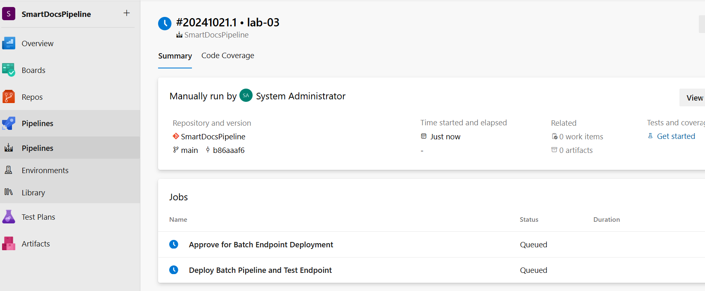
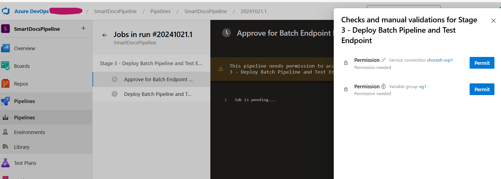
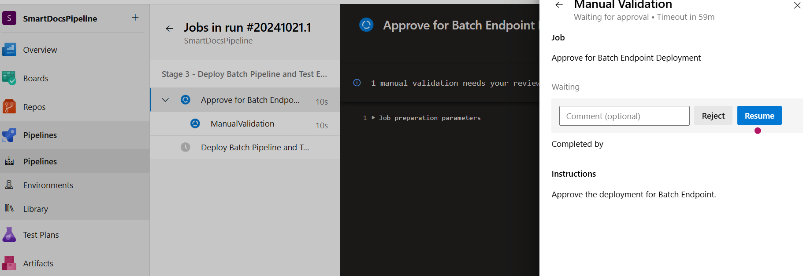
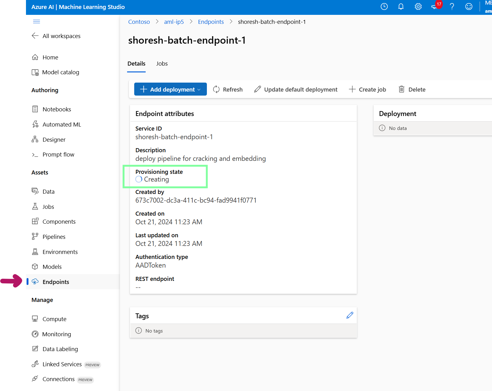
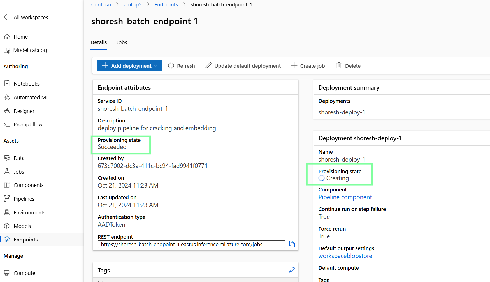
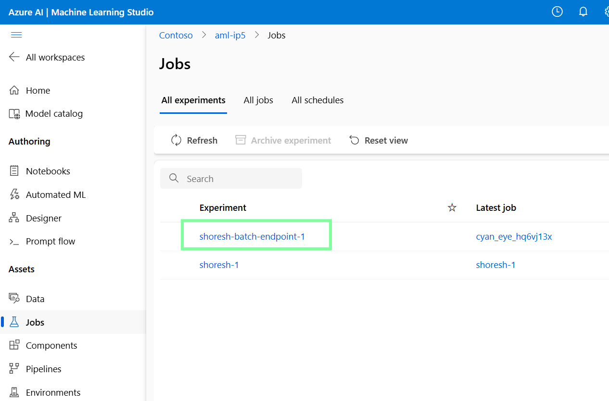
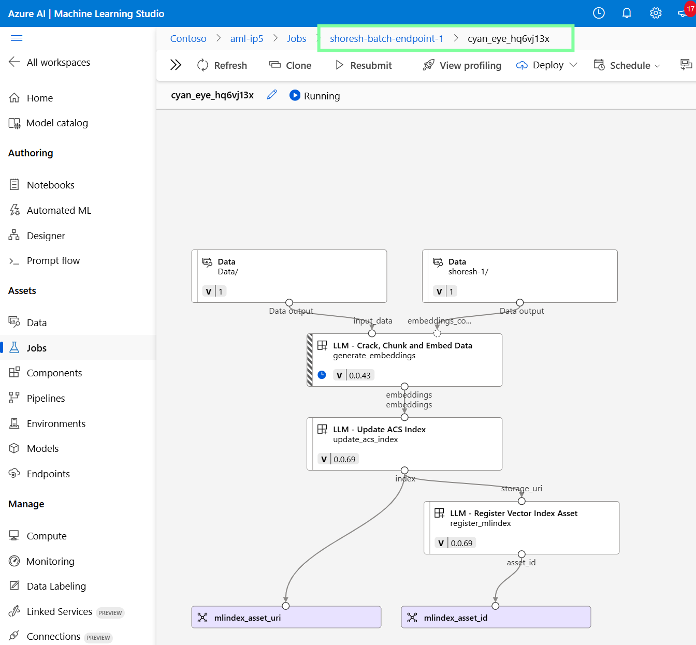
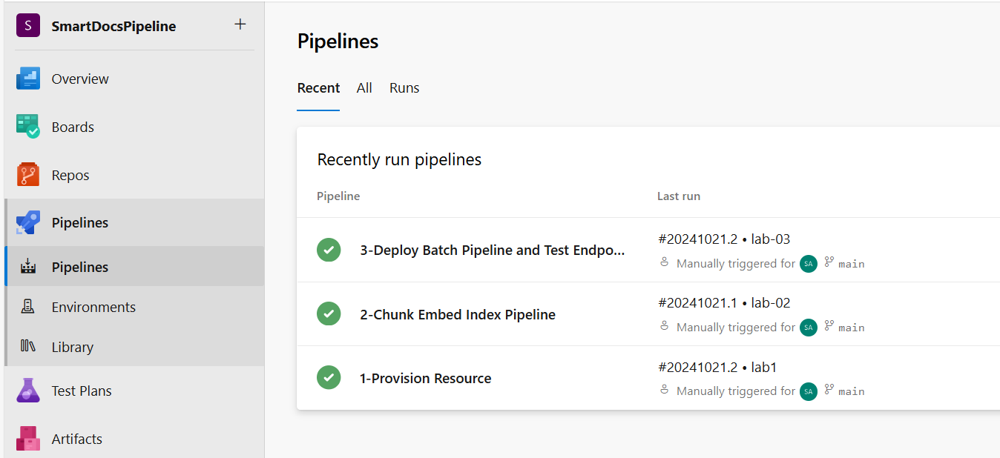

# Lab 03: Deploy Pipeline

## Prerequisites

Before proceeding with this lab, ensure that you have completed **Lab 01** and **Lab 02**.

## Setup

### Configure the `3-Deploy-BatchEndpoint.yml` in the Pipeline Folder

If your variable group is named `vg1` and your Azure DevOps project is named `SmartDocsPipeline`, you only need to modify the `definitionId` values. Use the `definitionId` from **Lab 01** for the `environment`, and the `definitionId` from **Lab 02** for the `pipeline-job_id`.

## Run the Pipeline

The goal of this stage is to deploy and test the Azure Machine Learning (Azure ML) pipeline, which performs chunking, embedding, and saves the index in **Azure AI Search** (from **Lab 02**).

1. Navigate to **Azure DevOps > SmartDocsPipeline > Pipelines > Create Pipeline > Azure Repos Git > SmartDocsPipeline > Existing Azure Pipelines YAML file**.
2. Select the `/Pipeline/3-Deploy-BatchEndpoint.yml` file.
3. Do **not** run the pipeline yet—just save it.
4. Return to **Pipelines**, rename the pipeline to **3-Deploy Batch Pipeline and Test Endpoint**, and run it.
5. You will be prompted for permission and approval. Provide the necessary permissions and approvals to proceed.

---

In **Azure ML Studio**, navigate to **Endpoints** and **Batch Endpoints**. You will observe the creation of the endpoint and the subsequent deployment of the pipeline.

---

The next step is to test the deployed pipeline. Head to **Azure ML Studio** and inspect the jobs created during this process.

The entire deployment and testing process may take several minutes.

## Summary

We have successfully deployed and tested our pipeline. This pipeline can now be used in a trigger-based scenario, such as when new data is added or deleted, to automatically update the index. There are several ways to implement a trigger-based setup, including combining **Azure Event Grid** with **Azure Logic Apps** or **Azure Functions**.

For more information on Azure Functions and Event Grid, refer to [Azure Functions with Event Grid Blob Trigger](https://learn.microsoft.com/en-us/azure/azure-functions/functions-event-grid-blob-trigger?pivots=programming-language-python).

## Deep Dive into `Pipeline/3-Deploy-BatchEndpoint.yml`

The `3-Deploy-BatchEndpoint.yml` YAML file automates the deployment of an Azure ML batch pipeline and tests the endpoint. It includes a manual approval step before deployment and uses the Azure CLI to run a Python script that manages the deployment.

### Key Stages:

1. **DeployBatchPipeline**:
   - **ApproveDeployment job**: A manual approval step requiring user intervention via email notification. Deployment proceeds after approval.
   - **DeployBatchPipeline job**: Once approved, the job installs Python dependencies, downloads artifacts, and runs the deployment script (`deploy_and_test_pipeline.py`). It uses the Azure CLI for authentication and ensures all necessary dependencies are in place.

## Deep Dive into `Chunk-Embedd-Index/deploy_and_test_pipeline.py`

The `deploy_and_test_pipeline.py` script automates the process of deploying and testing an Azure ML batch pipeline. Below is a breakdown of its primary functions:

### 1. Load and Parse Configuration:
- Parses a JSON file (`config.json`) containing batch deployment details such as the endpoint, deployment, asset name, and data source.
- Loads environment variables from a `.env` file, including Azure credentials (subscription ID, resource group, and workspace).

### 2. Authentication:
- Authenticates using `DefaultAzureCredential` for seamless access to Azure resources without passing credentials explicitly.
- Creates an `MLClient` instance for interacting with Azure ML services.

### 3. Batch Endpoint Creation:
- Creates or updates the batch endpoint, which will be the target for running the batch inference jobs.

### 4. Pipeline Deployment:
- Deploys the pipeline to the batch endpoint, ensuring the latest changes are used by forcing a rerun.
- Retrieves the `pipeline_job_id` from `pipeline_job_id.txt` for deployment.

### 5. Monitor Deployment Status:
- Continuously monitors the provisioning state of the deployment, handling any errors or retries as necessary.

### 6. Test the Endpoint:
- Invokes a test job after deployment, sending input data to the endpoint and specifying where to store the output.
- Streams logs to the console to track job progress.

### 7. Automation and Execution:
- The `main()` function ties all these processes together, ensuring the smooth automation of the deployment and testing of the batch pipeline.

The overall goal of this script is to automate the entire process, minimizing manual intervention while deploying and testing the batch pipeline in Azure Machine Learning.

