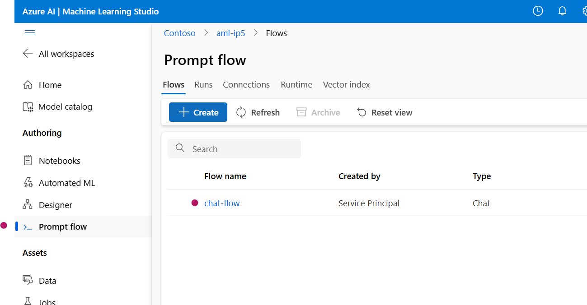
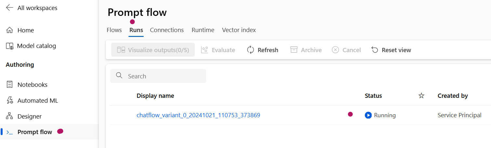
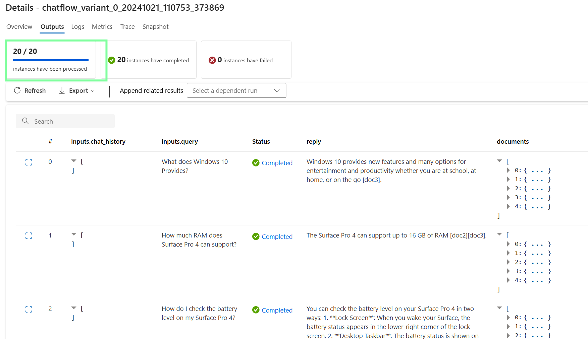

# Lab 04: Run and Evaluation Chat Flow

## Prerequisites

Before proceeding with this lab, ensure that you have completed **Lab 01** and **Lab 02**.

## Setup

### Configure the `4-RunFlow-Evaluation.yml` in the Pipeline Folder

If your variable group is named `vg1` and your Azure DevOps project is named `SmartDocsPipeline`, you only need to modify the `definitionId` values. Use the `definitionId` from **Lab 01** for the `environment`.

## Run the Pipeline

The goal of this stage is to create a chat flow with Promptflow and evaluate the flow pipeline.

1. Navigate to **Azure DevOps > SmartDocsPipeline > Pipelines > Create Pipeline > Azure Repos Git > SmartDocsPipeline > Existing Azure Pipelines YAML file**.
2. Select the `/Pipeline/4-RunFlow-Evaluation.yml` file.
3. Do **not** run the pipeline yet—just save it.
4. Return to **Pipelines**, rename the pipeline to **4-Run and Evaluate Chat Flow**, and run it.
5. You will be prompted for permission and approval. Provide the necessary permissions and approvals to proceed.

If you encounter errors like the following, rerun the pipeline:

2. Navigate to **Azure ML Studio** and verify the following:

Once the process is completed, you will see the following outputs:

The evaluation runs can be viewed as follows:

If necessary, you can modify the main chat flow by cloning the flow:

## Summary

In this stage, we created chat flow and evaluation pipelines to evaluate the performance of the chat flow based on `Data/data.jsonl`. For evaluation, we used two metrics: **Similarity** and **Groundedness**.

---

## Deep Dive into `Flow/generateyml.py`

### YAML File Generation Script for Azure Machine Learning Workflow

#### Goal

The script automates the generation and configuration of multiple YAML files used in a machine learning workflow that integrates with Azure Machine Learning services, Azure OpenAI models, and a search index.

### Primary Functions

#### 1. Loading Environment Variables and Configuration

- Loads critical environment variables from a `.env` file and configuration data from `config.json`, which includes:
  - Subscription IDs
  - Resource group names
  - API keys
  - OpenAI deployment names

#### 2. Templating and Value Replacement

- Constructs YAML templates for different components of the machine learning workflow, such as:
  - Chat flow
  - Similarity evaluation
  - Groundedness evaluation
- Dynamically replaces placeholders (e.g., `{{deployment_name}}` and `{{SUBSCRIPTION_ID}}`) with actual values from environment variables and configuration.

#### 3. Creating YAML Workflow Files

- Writes the formatted YAML files into locations such as:
  - `Flow/ChatFlow/flow.dag.yaml`
  - `Flow/Evaluation/Groundedness/flow.dag.yaml`
  - `Flow/Evaluation/Similarity/flow.dag.yaml`

  These files define workflows for tasks including:
  - **Chat flow**: Processes queries, rewrites intents, runs searches, chunks documents, and generates responses.
  - **Similarity and Groundedness evaluation**: Evaluates the similarity between a question and an answer and checks whether the generated responses are grounded in the provided context.

#### 4. Error Handling

- Validates that all required environment variables and configuration values are present, raising an error if any are missing.

### Summary

The script automates the process of configuring and deploying machine learning workflows by generating YAML files with the necessary API connections, models, and search components for evaluating responses in an Azure-based environment.

---

## Deep Dive into `Flow/chat_flow_and_eval.py`

### Script Goal

The script sets up and evaluates a chat flow using Azure Machine Learning and Azure OpenAI services.

### Key Objectives

#### Environment Setup
- Loads the necessary environment variables and configuration settings to connect to Azure services.

#### Authentication
- Authenticates to Azure securely, retrieving the necessary credentials.

#### Data Path Verification
- Verifies that the specified data file path exists, ensuring input data is available for evaluation.

#### Azure OpenAI Connection
- Establishes or updates a connection to Azure OpenAI to interact with models.

#### Data Asset Creation
- Registers a data asset with Azure Machine Learning containing the input data for evaluation.

#### Flow Execution
- Creates and runs a chat flow using the registered data asset to handle input queries and generate responses.

#### Flow Evaluation
- Evaluates the generated responses using similarity and groundedness metrics, comparing them with the ground truth.

#### Decision Making
- Computes a score based on the evaluation metrics and decides whether to proceed with deployment. The results are written to a JSON file.

#### Output Reporting
- Prints the combined metrics and deployment decision to the console.

---

In summary, this script automates the setup of an AI-driven chat system, runs it with test data, evaluates its performance, and makes deployment decisions based on the evaluation results.
