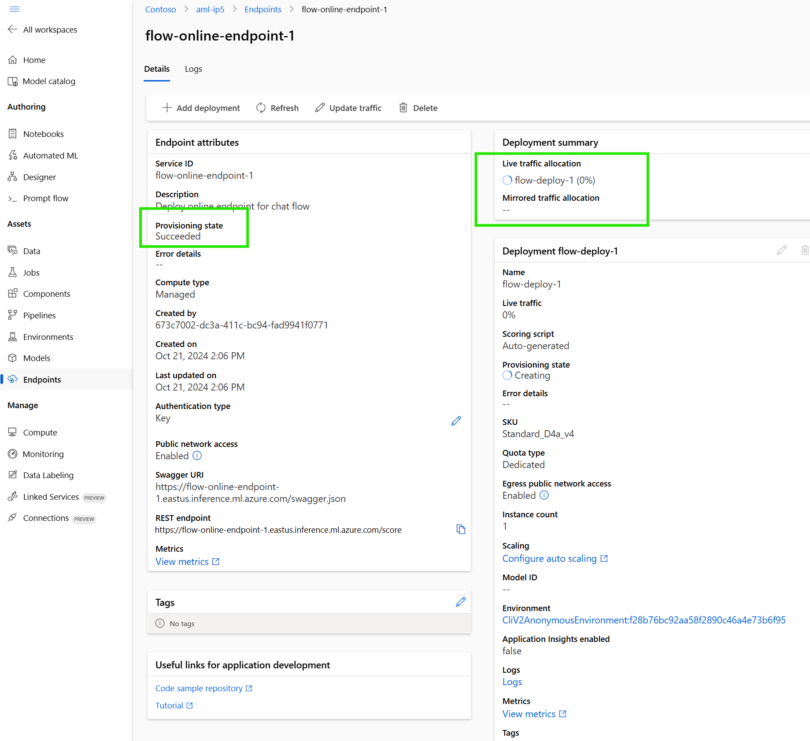

# Lab 05: Deploy Chat Flow as managed online endpoint

## Prerequisites

Before proceeding with this lab, ensure that you have completed **Lab 01** and **Lab 02** and **Lab 04**.

## Setup

### Configure the `5-Deploy-Flow.yml` in the Pipeline Folder

If your variable group is named `vg1` and your Azure DevOps project is named `SmartDocsPipeline`, you only need to modify the `definitionId` values. Use the `definitionId` from **Lab 01** for the `environment`and **Lab 04** for DeployFlow


## Run the Pipeline

The goal of this stage is to create a chat flow with Promptflow and evaluate the flow pipeline.

1. Navigate to **Azure DevOps > SmartDocsPipeline > Pipelines > Create Pipeline > Azure Repos Git > SmartDocsPipeline > Existing Azure Pipelines YAML file**.
2. Select the `/Pipeline/5-Deploy-Flow.yml` file.
3. Do **not** run the pipeline yet—just save it.
4. Return to **Pipelines**, rename the pipeline to **5-Deploy Chat Flow**, and run it.
5. You will be prompted for permission and approval. Provide the necessary permissions and approvals to proceed.

2. In **Azure ML Studio**, navigate to **Endpoints** and **Real-time Endpoints**. You will observe the creation of the endpoint and the subsequent deployment of the pipeline.




3. The Pipeline deploy flow as managed online endpoint an test enpoint BUT you can test it manaualy too 


## Summary

In this stage, we deployed chat flow as managed online endpoint and now we can use it in our application. 

---

## Deep Dive into `Flow/deploy_test_flow.py`

## Azure ML Deployment Script - Key Points

This Python script automates the deployment of a machine learning model to Azure, setting up an endpoint and deploying a model in a managed online environment. Key functionalities include loading configurations, authenticating, creating role assignments, deploying the model, and testing the endpoint.

### Overview
The script performs the following main tasks:
1. **Configuration Loading** - Reads configuration from a JSON file and environment variables.
2. **ML Client Authentication** - Authenticates using Azure's `DefaultAzureCredential`.
3. **Role Assignment** - Sets role-based access to Azure resources.
4. **Endpoint Creation** - Creates or updates an online endpoint for model deployment.
5. **Model Deployment** - Deploys a machine learning model and an environment for inference.
6. **Deployment Status Check** - Monitors deployment progress until successful.
7. **Endpoint Testing** - Tests the deployed model endpoint with sample data.

### Functions

#### 1. `load_config()`
- Loads settings from `config.json` and environment variables (`.env`).
- Returns essential deployment parameters (e.g., subscription ID, resource group, compute size).

#### 2. `get_ml_client(config)`
- Authenticates and returns an MLClient using `DefaultAzureCredential`.

#### 3. `create_role_assignment(scope, role_name, principal_id)`
- Assigns specific roles (e.g., `Cognitive Services OpenAI User`, `Search Index Data Contributor`) to the model endpoint.
- Enables secure access to required Azure resources.

#### 4. `create_endpoint(config)`
- Sets up an online endpoint to handle requests for the deployed model.
- Uses Azure CLI to create role assignments for identity-based access control.

#### 5. `deploy_managed_online(config)`
- Deploys the model and environment on Azure ML.
- Defines health check routes and sets environment variables for deployment.
- Sets traffic routing to the deployed endpoint (100% traffic to the current deployment).

#### 6. `wait_for_deployment(config)`
- Checks deployment status periodically until completion.
- Logs deployment status and retries on errors.

#### 7. `test_endpoint(config)`
- Validates the endpoint with a sample JSON request.
- Uses primary key for authentication and handles HTTPS self-signed certificates if necessary.
- Attempts multiple retries on failure.

#### 8. `get_decision_from_json(path_file)`
- Reads the `deploy.json` file for a "decision" key to control script execution.
- If the decision is "yes," the main deployment process starts.

### Execution Flow (`main()`)
1. Loads configurations and environment variables.
2. Creates and configures the endpoint.
3. Deploys the model and waits for successful deployment.
4. Tests the endpoint and validates model predictions.

### Usage
To execute, run the script directly:
```python
python <script_name.py>
