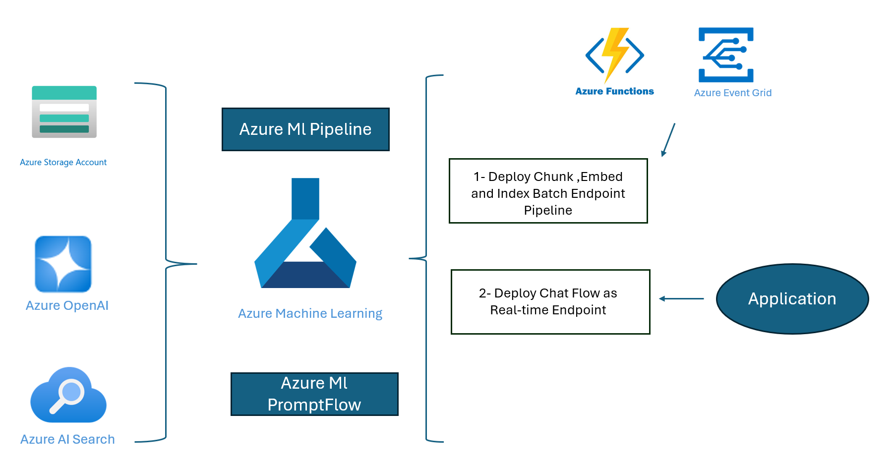

# Generative AI Pipeline in Azure

## Overview
This project serves as an accelrator(demo)  and tutorial on how to use generative AI in Azure to create an automated pipeline for data ingestion, chunking, embedding, indexing, and deployment. When dealing with vast amounts of unstructured data in formats such as PDF, TXT, and others, extracting meaningful insights can be challenging. This is where generative AI and the Retrieval-Augmented Generation (RAG) approach come into play, enabling the creation of a chatbot that can answer your questions and facilitate interaction with your data.

## Getting Started
You have two options to explore this project:

1. **Lab Folder:** This folder contains step-by-step guidelines to perform various labs. You can follow these instructions to understand each component of the pipeline in detail.[Lab 1-5](Labs)

2. **E2E Folder:** If you prefer a more streamlined approach, you can use the End-to-End (E2E) folder. This folder includes a complete implementation of the pipeline, allowing you to see how everything works together seamlessly. [End-to-End Overview](E2E/e2e.md)

## Disclaimer
This project is provided for educational purposes only. We do not take any responsibility for any issues, damages, or losses that may arise from the use of this project or its components. By using this project, you acknowledge that you do so at your own risk.